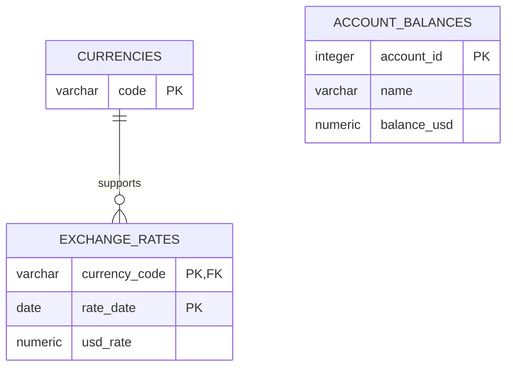

# Ledger Balance Aggregation — Architecture

## System shape

```text
transactions.csv ─┐
                  ├──> ledger-ingest ──> PostgreSQL live tables
exchange_rates.csv┘          exits                 │
                                                   │
                                      ledger-serve  │
                                                   v
                                    FastAPI read API
                                                   ^
                                                   │ HTTP /api
                                                   │
                                             React frontend
```

The ingestion CLI and FastAPI server are separate entry points and separate
process lifecycles. PostgreSQL remains available between them and is the sole
source of truth for reads.

## Component boundaries

### Input and domain layer

`backend/src/ledger_balance/input/` parses CSV rows, validates headers and
values, and enforces historical rate coverage. `backend/src/ledger_balance/domain/`
contains immutable domain models, currency/account value objects, Decimal
arithmetic, and the sequential reference reducer used by tests and benchmarks.

This layer has no database or HTTP dependency, making arithmetic and parser
behavior straightforward to test independently.

### Database layer

`backend/src/ledger_balance/db/` owns the bounded asyncpg connection pool and
health checks. PostgreSQL schema changes are versioned in
`backend/migrations/` and applied through Alembic, not during request handling.

The live schema contains three tables:



- `currencies` is the API's supported-currency source of truth.
- `exchange_rates` stores every historical input rate and references its
  currency through a foreign key.
- `account_balances` stores exactly one current USD balance per account.

All financial columns use `NUMERIC(38,18)`. Account IDs are constrained to
100–999; rates are positive; negative balances are allowed.

There are deliberately no import-run, snapshot, staging, publication, or raw
transaction tables. The design prioritizes correct concurrent updates and
simple live reads over zero-downtime dataset replacement.

## Ingestion design

`backend/src/ledger_balance/ingestion/` implements replacement ingestion.

1. The full rate file is parsed before the reset, preventing an invalid rate
   file from clearing a previously loaded dataset.
2. The live tables are truncated in dependency-safe order.
3. Currencies and rates are inserted in one database transaction.
4. Transaction rows are streamed through `asyncio.Queue(maxsize=concurrency)`.
5. A fixed number of workers obtains one pool connection per row and performs
   one atomic upsert.
6. Worker or producer failure cancels the bounded pipeline and awaits cleanup.
7. The CLI closes the pool in `finally` and exits with a non-zero status on
   failure.

The critical write is:

```sql
INSERT INTO account_balances (account_id, name, balance_usd)
VALUES ($1, $2, $3)
ON CONFLICT (account_id) DO UPDATE
SET name = EXCLUDED.name,
    balance_usd = account_balances.balance_usd + EXCLUDED.balance_usd;
```

PostgreSQL locks the conflicting row while evaluating the additive update.
There is no application-level `SELECT`, add, then `UPDATE` race, so concurrent
workers cannot overwrite one another's increments. Queue capacity, worker
count, and pool maximum are bounded; ingestion concurrency cannot exceed the
configured pool maximum.

## Read path

`backend/src/ledger_balance/api/repository.py` uses one SQL statement for each
account or total query. The statement obtains the stored USD amount and the
requested currency's newest rate from the same statement snapshot. USD bypasses
FX lookup. Non-USD conversion is exact Decimal division in Python, followed by
one round-half-even presentation quantization.

Each request sees committed data available when its query starts. Since
ingestion updates live tables directly, separate requests may observe different
progress points during a run. This is intentional and documented behavior.

`backend/src/ledger_balance/api/routes.py` validates path/query input, maps
repository outcomes to stable error codes, and constructs Pydantic response
models. `api/http_context.py` supplies request IDs, safe response headers, and
duration logging. `api/exception_handlers.py` prevents internal exception
details from reaching clients. A bounded process-local rate limiter protects
the read routes from accidental bursts.

## Frontend architecture

The frontend keeps transport, state, and presentation separate:

```text
frontend/src/api/        fetch client, typed contracts, errors, async states
frontend/src/hooks/      request cancellation and stale-response protection
frontend/src/components/ presentational cards, form, selector, feedback, footer
frontend/src/App.tsx     page composition and workflow wiring
```

Each total/account request owns an `AbortController` and monotonically
increasing sequence token. A superseded currency or account response is ignored
and aborted requests are silent. Components render API money strings; no browser
calculation can alter authoritative values.

## Configuration and lifecycle

Backend settings come from `backend/.env` and frontend public configuration from
`frontend/.env.local`. Only `VITE_*` values belong in the frontend environment.
The API reads `DATABASE_URL`, pool bounds, host/port, CORS origin, query timeout,
and rate-limit settings. Migrations are applied explicitly with `make migrate`.

The expected local lifecycle is:

```text
make db-up
make migrate
make fixtures
make ingest
make api             # separate terminal/process
make frontend        # separate terminal/process
```

## Failure and consistency trade-offs

- A failed run may leave partial live data; rerun clears and rebuilds it.
- API responses during ingestion may be empty, partial, or changing.
- No old snapshot is retained and no atomic whole-import publication is used.
- Individual additive writes are not automatically retried because an unknown
  timeout may hide a committed increment and retrying could double-apply it.
- The database pool and queue are bounded to provide backpressure.

## Verification strategy

Unit tests cover pure arithmetic, parsers, validation, API conversion, and
frontend state. Integration tests cover migrations, constraints, persistence,
concurrent contention, reruns, failure recovery, and API reads against the
Docker PostgreSQL instance. The benchmark compares every stored account row and
the exact total with an independent sequential Decimal oracle.
