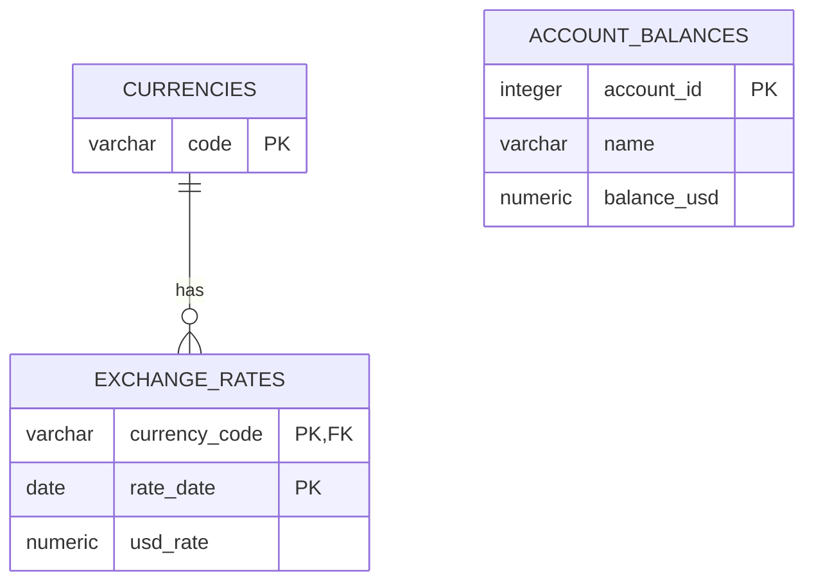

# Database Model

## Purpose

The database stores supported currencies, historical exchange rates, and one current USD balance per account. It deliberately has no import metadata, versioned snapshots, active pointer, or staging tables.

## Logical relationships



## Table contracts

### `currencies`

Defines the currencies accepted by the API.

| Column | Type | Rules |
| :--- | :--- | :--- |
| `code` | `VARCHAR(8)` | Primary key, uppercase, non-empty |

No `latest_rate_date` column is stored. The latest date is derived from persisted rates so duplicated metadata cannot become stale.

### `exchange_rates`

Stores all historical input rates.

| Column | Type | Rules |
| :--- | :--- | :--- |
| `currency_code` | `VARCHAR(8)` | Foreign key to `currencies(code)` |
| `rate_date` | `DATE` | Required |
| `usd_rate` | `NUMERIC(38,18)` | Required and greater than zero |

Primary key: `(currency_code, rate_date)`.

The rate means:

```text
1 unit of currency × usd_rate = USD
```

Recommended read index: `(currency_code, rate_date DESC)`.

### `account_balances`

Stores one current final USD balance per account.

| Column | Type | Rules |
| :--- | :--- | :--- |
| `account_id` | `INTEGER` | Primary key, between 100 and 999 |
| `name` | `VARCHAR(255)` | Required and non-empty |
| `balance_usd` | `NUMERIC(38,18)` | Required; negative allowed |

## Ingestion lifecycle

At the start of each run, clear tables in foreign-key-safe order:

1. `account_balances`;
2. `exchange_rates`;
3. `currencies`.

Then insert currencies and rates and apply transaction deltas directly to `account_balances`. The implementation assumes only one ingestion process runs at a time.

The API may read during this process. Every SQL statement observes PostgreSQL's committed state at the start of that statement, but separate requests may see balances change as more transaction writes commit. No stable whole-import view is promised.

If ingestion fails, committed rows remain partial. The next run clears all three tables and starts again.

## Concurrent balance update

Each worker adds a USD delta directly to the live balance table:

```sql
INSERT INTO account_balances (
    account_id,
    name,
    balance_usd
)
VALUES ($1, $2, $3)
ON CONFLICT (account_id)
DO UPDATE SET
    balance_usd = account_balances.balance_usd
                + EXCLUDED.balance_usd;
```

PostgreSQL serializes conflicting changes to the same row, preventing lost increments. Account-name consistency is assumed by the happy-path input contract.

## Required invariants

- `currencies` is the supported-currency source of truth.
- Every rate references a supported currency.
- Each `(currency, date)` has at most one rate.
- Every rate is positive.
- `account_balances` contains at most one row per account ID.
- Negative balances remain valid.
- Each committed atomic increment is preserved regardless of worker interleaving.
- Empty, partial, and progressively changing API results during ingestion are accepted.
